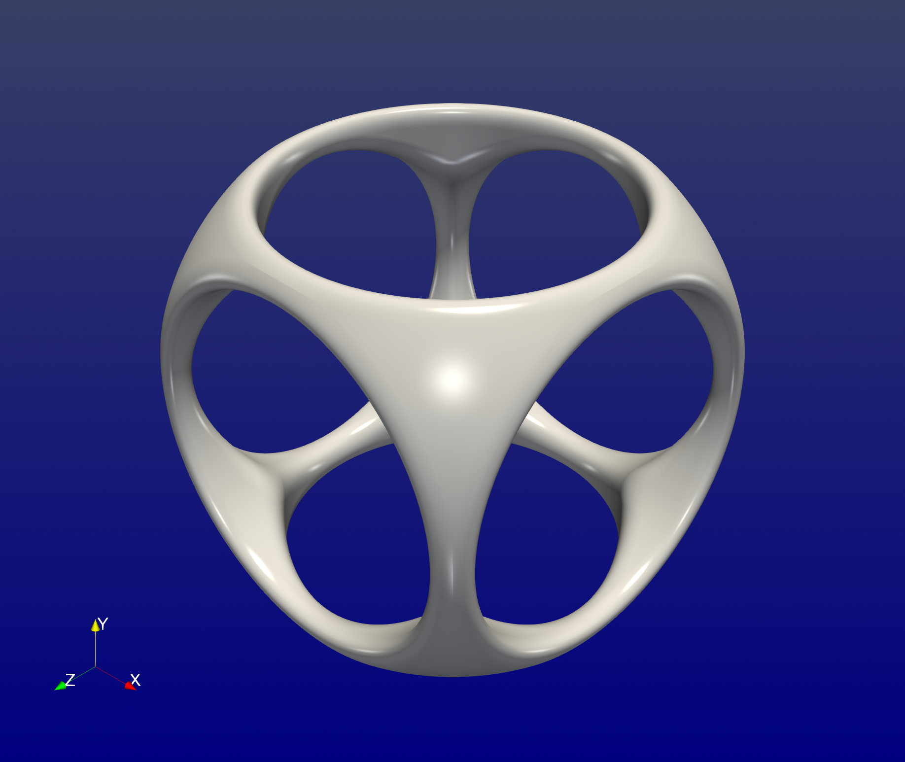

# ImplicitGeometries.jl

[](https://suitesplines.github.io/ImplicitGeometries.jl/stable/)
[](https://suitesplines.github.io/ImplicitGeometries.jl/dev/)
[](https://codecov.io/gh/SuiteSplines/ImplicitGeometries.jl)
[](https://github.com/SuiteSplines/CartesianProducts.jl/actions/workflows/CI.yml)

This package enables construction of implicit geometries by composition of
primitive shapes described by signed distance functions. It supports
evaluation of gradients and normals of such implicit representations.

## Installation

This package is registered in the General registry.

```julia-repl
pkg> add ImplicitGeometries
```

## Example



```julia-repl
julia> using ImplicitGeometries, AbstractTrees, StaticArrays, LinearAlgebra

julia> k = 0.1; # smoothness factor

julia> b1 = Box(; w=2.0, h=2.0, d=2.0)
Box{3, Float64}

julia> s1 = Sphere(; r=1.3)
Sphere{3, Float64}

julia> i1 = SmoothIntersection(s1, b1; k = k)
SmoothIntersection{3, Float64}

julia> c1 = Cylinder(; h = 2.0, r = 0.8)
Cylinder{3, Float64}

julia> c2 = Rotation(Cylinder(; h = 2.0, r = 0.8); ϕ = π/2, θ = 0.0, ψ = 0.0)
Rotation{3, Float64}

julia> c3 = Rotation(Cylinder(; h = 2.0, r = 0.8); ϕ = 0.0, θ = 0.0, ψ = π/2)
Rotation{3, Float64}

julia> u1 = SmoothUnion(c1, c2; k = k)
SmoothUnion{3, Float64}

julia> u2 = SmoothUnion(u1, c3; k = k)
SmoothUnion{3, Float64}

julia> s2 = SmoothSubtraction(i1, u2; k = k)
SmoothSubtraction{3, Float64}

julia> geometry = Scaling(s2; s=7.0)
Scaling{3, Float64}

julia> print_tree(geometry; maxdepth=10)
Scaling (s = 7.0)
└─ SmoothSubtraction
   ├─ SmoothIntersection
   │  ├─ Sphere (r = 1.3)
   │  └─ Box (w = 2.0, h = 2.0, d = 2.0)
   └─ SmoothUnion
      ├─ SmoothUnion
      │  ├─ Cylinder (r = 0.8, h = 2.0)
      │  └─ Rotation (ϕ = 90.0°, θ = 0.0°, ψ = 0.0°, dx = 0.0, dy = 0.0, dz = 0.0)
      │     └─ Cylinder (r = 0.8, h = 2.0)
      └─ Rotation (ϕ = 0.0°, θ = 0.0°, ψ = 90.0°, dx = 0.0, dy = 0.0, dz = 0.0)
         └─ Cylinder (r = 0.8, h = 2.0)

julia> p = SVector(1.0, 2.0, 3.0)
3-element StaticArraysCore.SVector{3, Float64} with indices SOneTo(3):
 1.0
 2.0
 3.0

julia> geometry(p)
3.3639320225002107

julia> gradient = Gradient(geometry)
Gradient{3, Float64}

julia> gradient(p)
3-element SVector{3, Float64} with indices SOneTo(3):
 -0.44721359576893605
 -0.8944271904631762
  1.788854397943851e-5

julia> norm(gradient(p))
0.9999999998002161
```
