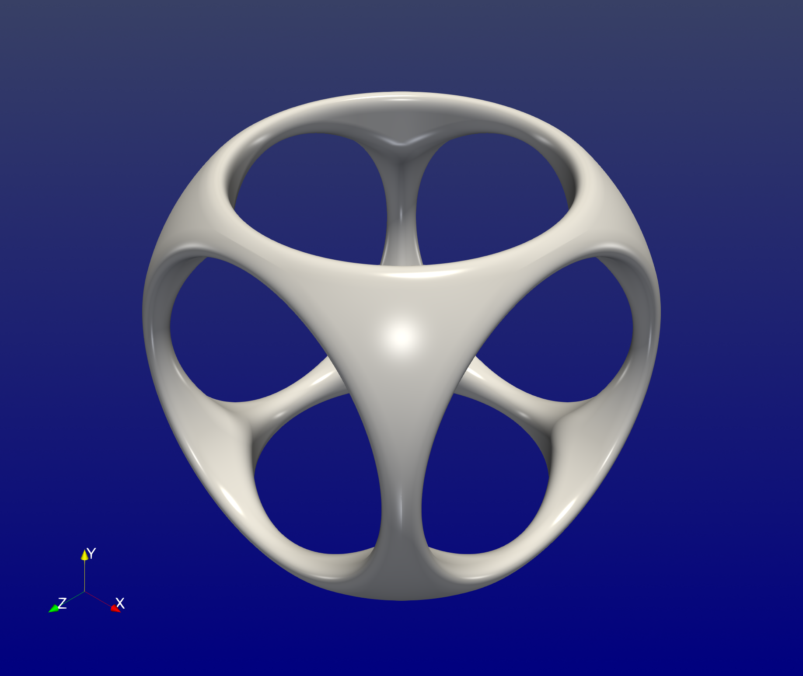
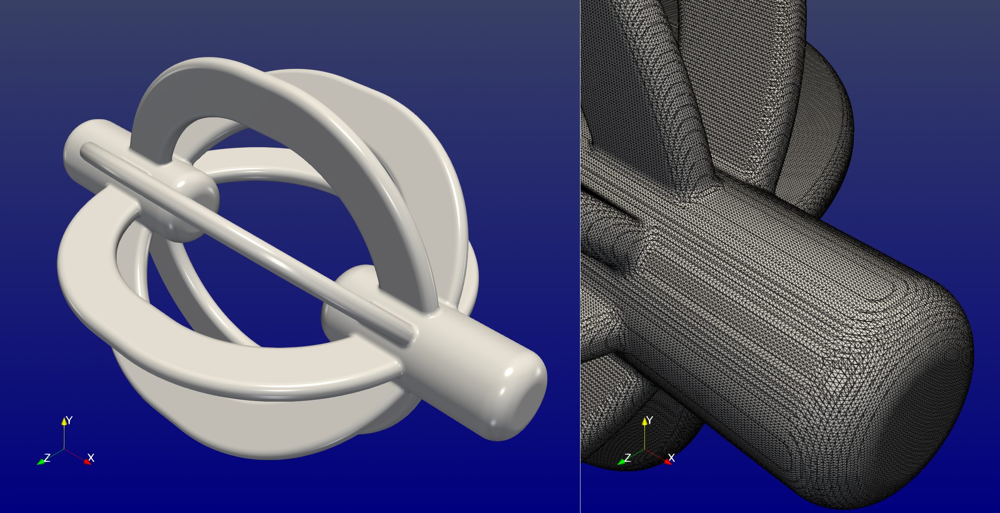
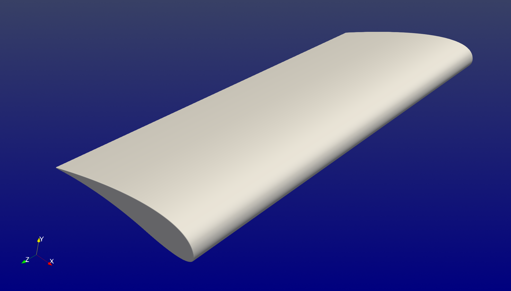

```@meta
CurrentModule = ImplicitGeometries
```

# Examples

This page collects a few examples for using `ImplicitGeometries.jl`.

## Smooth boolean operations

The following constructs the canonical geometry showcasing boolean operations
on primitive geometries. Here, we will use the smooth counterparts of the standard
boolean operations. The factor `k` controls the smoothness.

```@repl examples
using ImplicitGeometries

k = 0.1; # smoothness factor
b1 = Box(; w=2.0, h=2.0, d=2.0)
s1 = Sphere(; r=1.3)
i1 = SmoothIntersection(s1, b1; k = k)
c1 = Cylinder(; h = 2.0, r = 0.8)
c2 = Rotation(Cylinder(; h = 2.0, r = 0.8); ϕ = π/2, θ = 0.0, ψ = 0.0)
c3 = Rotation(Cylinder(; h = 2.0, r = 0.8); ϕ = 0.0, θ = 0.0, ψ = π/2)
u1 = SmoothUnion(c1, c2; k = k)
u2 = SmoothUnion(u1, c3; k = k)
s2 = SmoothSubtraction(i1, u2; k = k)
geometry = Scaling(s2; s=7.0)
```

To print the construction tree, you can use

```@repl examples
using AbstractTrees
print_tree(geometry; maxdepth=10)
```

The signed distance function can be evaluated at some position `p` as follows

```@repl examples
using StaticArrays
p = SVector(1.0, 2.0, 3.0)
geometry(p)
```


## Visualization

`ImplicitGeometries.jl` only defines implicit geometries. External tools are needed for visualization.

### Clip by scalar

One way to visualize the implicitly defined geometry is to sample the
signed distance function on a grid of points and export it a VTK file using
[WriteVTK.jl](https://github.com/JuliaVTK/WriteVTK.jl).

```julia
using WriteVTK

# define sampling grid
Ix = LinRange(-7.5, 7.5, 100)
Iy = LinRange(-7.5, 7.5, 100)
Iz = LinRange(-7.5, 7.5, 100)
x = Base.Generator(p -> SVector{3}(p), Iterators.product(Ix, Iy, Iz))

# sample geometry, gradient and normals
ϕ = broadcast(geometry, x);
∇ϕ = broadcast(gradient, x);
n = broadcast(normal, x);

# export to vtk file
vtk_grid("sdf", Ix, Iy, Iz) do vtk
    vtk["ϕ"] = ϕ
    vtk["∇ϕ"] = ∇ϕ
    vtk["n"] = n
end
```
To show the zero levelset one can load the VTK file in [Paraview](https://www.paraview.org/) and clip the dataset by a scalar (i.e. the signed distance function at zero). The normals can be used to improve
the lighting. The final result is shown below.



### Marching cubes

Another way, which is arguably faster and gives better results for three-dimensional signed distance functions, is to use [MarchingCubes.jl](https://github.com/JuliaGeometry/MarchingCubes.jl) to extract the surface. The normals can be then evaluated on that extracted surface only. Finally, the dataset can be exported using [WriteVTK.jl](https://github.com/JuliaVTK/WriteVTK.jl).

Consider the following geometry
```@repl examples
geometry = Ring(Rectangle(; w=1.0, h=0.05), r=0.2);
geometry = Revolution(geometry, o=4.0);
geometry = Elongation(geometry; dx=0.5);
rotated1 = Rotation(geometry; ϕ=π/2);
rotated2 = Rotation(geometry; ϕ=π/2+π/4);
rotated3 = Rotation(geometry; ϕ=π/2-π/4);
geometry = SmoothUnion(geometry, rotated1);
geometry = SmoothUnion(geometry, rotated2);
geometry = SmoothUnion(geometry, rotated3);
geometry = SmoothUnion(geometry, Translation(Rotation(Ring(Cylinder(; r=0.5, h=2.0); r=0.5); ψ=π/2); dx = -5.0));
geometry = SmoothUnion(geometry, Translation(Rotation(Ring(Cylinder(; r=0.5, h=2.0); r=0.5); ψ=π/2); dx = 5.0));
print_tree(geometry; maxdepth=10)
```
The extraction of the surface using marching cubes is straightforward,

```julia
using MarchingCubes, WriteVTK

# define sampling grid
Ω = ((-7.5, 7.5), (-5.0, 5.0), (-5.0, 5.0))
Ix = LinRange(Ω[1]..., 400)
Iy = LinRange(Ω[2]..., 400)
Iz = LinRange(Ω[3]..., 400)
x = Base.Generator(p -> SVector{3}(p), Iterators.product(Ix, Iy, Iz))

# sample sdf at the grid of points
ϕ = broadcast(geometry, x);

# initialize and execute marching cubes
mc = MC(ϕ, Int32, x=Ix, y=Iy, z=Iz);
march(mc)

# collect vertex points, triangualr cells, normals and export
points = reduce(hcat, mc.vertices)
cells = map(t -> MeshCell(VTKCellTypes.VTK_TRIANGLE, t), mc.triangles)
vtk_grid("mc", points, cells) do vtk
    vtk["n"] = broadcast(normal, mc.vertices)
end
```

The result is a surface mesh shown below



A key advantage of this approach is that the resulting surface mesh can be imported into
[MeshLab](https://www.meshlab.net/), which  allows for generating meshes suitable for analysis.
This makes it possible to perform both immersed and boundary-fitted finite element computations
on geometries modeled with `ImplicitGeometries.jl`.


## Quadratic Bezier curves

Two-dimensional signed distance function can be generated from closed multisegment
Bezier curves. Consider the following simple airfoil modeled by three quadratic Bezier
segments

```@repl examples
airfoil = [
           SVector(-1.0,  0.0), SVector( 0.91070,  0.39097), SVector( 1.0,  0.0),
           SVector( 1.0,  0.0), SVector( 1.06054, -0.26505), SVector( 0.4, -0.1),
           SVector( 0.4, -0.1), SVector(-0.20900,  0.05217), SVector(-1.0,  0.0)
];
geometry = QuadraticBezier(; v=airfoil)
geometry = Ring(geometry; r=0.005)
geometry = Rotation(geometry; θ = deg2rad(15))
print_tree(geometry)
```
The result together with the gradient of the signed distance function and the normals
is shown below.


The two-dimensional airfoil can be extruded to obtain a three-dimensional airfoil

```@repl examples
geometry = QuadraticBezier(; v=airfoil)
geometry = Rotation(geometry; θ = deg2rad(15))
geometry = Scaling(geometry; s=2.0)
geometry = Extrusion(geometry; h=5.0)
geometry = Ring(geometry; r=0.0125)
print_tree(geometry)
```



